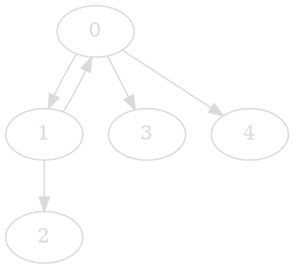
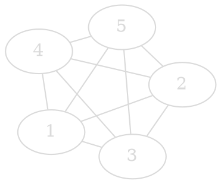
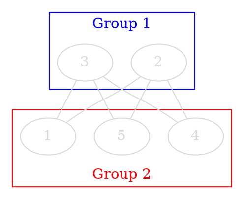
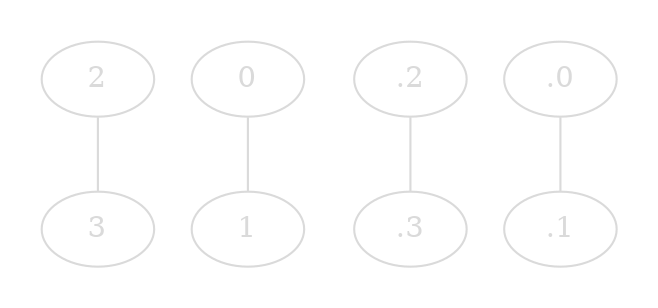

A graph $G = (V, E)$ is a non-empty set of __nodes__ (or vertices) $V$ and a (possibly empty) list of __Edges__ $E$.

>__Example:__
>Airports: $V = \{NY, D, L, C\}$
>With flights: $E = \{(NY,D),(NY,L),(D,C),(D,L)\}$

## Definitions
---
1. The vertices $u$ and $v$ are __adjacent__ if there is an edge $e$ connecting them. In this case, $u$ and $v$ are __endpoints__ of the edge $e$
2. A __loop__ is an edge connecting a vertex to itself.
3. An __isolated vertex__ is a vertex which is not the endpoint of any edge.
4. Two edges are __parallel (multiple)__ if they have common endpoints.
5. A graph is called __simple__ if it has NO loops or parallel edges.   
__Degree of a vertex:__
1. The __degree__ of a vertex $v$, written $deg(v)$, is the number of edge ends at the vertex.
__Paths (or Trails):__
1. A __path__ from vertex $v_0$ to vertex $v_k$ is a sequence $v_0,e_0,v_1,e_1,v_2,e_2,\dots,v_{k-1},e_{k-1},v_k$.
2. The __length of a path__ is the number of edges it contains.
3. A graph is __connected__ if there exists a path between any two vertices in the graph.
4. A __cycle__ is a path from a vertex $v_0$ back to $v_0$, where:
	- no edge appears more than once in the path sequence
	- $v_0$ is the only vertex appearing more than once
	- $v_0$ occurs only at the beginning and the end of the sequence
5. A graph with NO cycles is called __acyclic__.

## Theorems
---
__The First Theorem in Graph Theory, Euler (1736):__$$\sum_{v \in V} deg(v) = 2\mid E\mid$$
__The Handshaking Lemma:__ Every graph has an even number of vertices of odd degree.
__Complete Graphs $K_n$__: where n ⩾ 1 $K_n$ is a simple complete graph with n vertices.
>__Example:__

__Bipartite Complete Graph:__ A graph is a _bipartite complete graph_ if its vertices can be partitioned into two disjoint nonempty sets $V_1$ and $V_2$ such that two vertices $x$ and $y$ are adjacent if and only if $x \in V_1$ and $y \in V2$.
>__Exmample:__

__Isomorphic Graph:__ Two graphs are isomorphic if:
1. There is a _[[5. Functions#^505e7f|bijection]] $f$_ from $V1$ to $V2$ such that $(v, u) ∈ E1 ⇔ (f(v), f(u)) ∈ E.$
2. The parallelism of edges is also preserved, i.e. the number of edges joining $v$ and $u$ equals the number of edges joining $f(v)$ and $f(u)$.
>__Example:__

__Eulerian Cycles/Circuits:__
An _Eulerian trail (path)_ in a graph is a path that __visits every edge__ of the graph __exactly once__.
An _Eulerian cycle (circuit)_ is an _Eulerian trail_ which begins and ends at the same vertex.

__Hamiltonian Cycles/Circuits:__
A _Hamiltonian trail (path)_ is a path that __visits every vertex__ of the graph __exactly once__.
A _Hamiltonian cycle (circuit)_ is a _Hamiltonian trail_ which begins and ends at the same vertex.